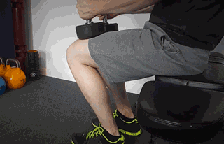

大肌群+小肌群训练

没有特殊说明的，都是3组*10RM

### 热身动作（10-15次）

1. 手腕打圈

   

2. 水平摆臂

   

3. 对侧摆臂

   

4. 甩手臂

   

5. 转体

   

6. 弹力带伸展

   

7. 弹力带拉开

   

8. 绳索肩部伸展

   

9. 哑铃肩部伸展

   

10. 摆腿

    

11. 侧摆腿

    

12. 深蹲拉伸（6）

    

13. 屈膝铁十字（各侧6次）

    

14. 登山者拉伸（单腿5次）

    

15. 靠墙脚踝拉伸（单腿5次）

    

### 周一：胸肌+肱三头肌

杠铃平板卧推

哑铃卧推

哑铃飞鸟

前举和上拉

坐姿肱三头肌推举

仰卧哑铃肱三头肌屈伸

### 周三：背部+肱二头肌

宽轴硬拉

坐姿下拉

坐姿划船

杠铃俯身划船

杠铃弯举

站姿哑铃交替弯举

坐姿哑铃集中弯举

### 周五：肩部三角肌+腹肌

坐姿哑铃推举

杠铃颈前推举

哑铃侧平举

哑铃前平举

哑铃俯身飞鸟

卷腹 3*15

反向卷腹 3*15

转体卷腹 3*15

### 周日：臀腿部

杠铃深蹲 / 哑铃箱式深蹲 

腿举机 / 前箱跳 / 哑铃深蹲

杠铃箭步蹲 / 哑铃箭步蹲

器械腿屈伸 / 哑铃后弓步

负重臀桥 3*15 / 臀桥提踵3\*15

提踵 3*15

#### 臀腿部拉伸

10-15的拉伸动作做一遍